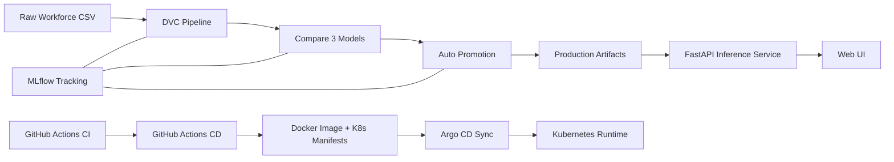

# Workforce Intelligence MLOps

CI/CD is handled via GitHub Actions (check the Actions tab for live status).

Production-ready workforce forecasting platform with a modular FastAPI app, multi-head deep learning, and full MLOps automation (DVC + MLflow + CI/CD + GitOps).

## What This Project Predicts

Single shared neural representation with 4 output heads:

1. Hiring (`regression`)
2. Layoffs (`regression`)
3. Layoff Risk (`binary classification`)
4. Workforce Volatility (`regression`)

## Tech Stack

- Backend/API: `FastAPI`, `Uvicorn`
- Model stack: `PyTorch`, `scikit-learn`
- Experiment tracking: `MLflow`
- Data/model versioning: `DVC` (S3 remote)
- Orchestration: `DVC pipeline` (`dvc.yaml`)
- CI: `GitHub Actions`
- CD/GitOps: `GitHub Actions + Argo CD + Kubernetes`
- Packaging/runtime: `Docker`

## System Architecture



## Repository Layout

```text
workforce-mlops/
├── .github/workflows/          # CI/CD pipelines
├── deploy/                     # Kubernetes + Argo CD manifests
├── docker/                     # Dockerfile + runtime entrypoint
├── docs/                       # deployment and ops playbooks
├── experiments/                # notebook experiments (ignored in git)
├── scripts/                    # bootstrap/provision/deploy helpers
├── src/workforce_mlops/
│   ├── api/                    # FastAPI app + frontend assets
│   ├── data/                   # ingest/validate/preprocess
│   └── models/                 # train/compare/promote/evaluate/predict
├── tests/
├── dvc.yaml
├── params.yaml
└── requirements.txt
```

## Quick Start (Local)

```bash
cd workforce-mlops
bash scripts/bootstrap.sh
bash scripts/create_venv.sh
source .venv/bin/activate
pip install -r requirements.txt
```

Windows (PowerShell):

```powershell
Set-Location workforce-mlops
powershell -ExecutionPolicy Bypass -File .\scripts\create_venv.ps1
.\.venv\Scripts\Activate.ps1
pip install -r requirements.txt
```

## Data + Training Pipeline

Place dataset at:

```text
data/raw/workforce.csv
```

Run full reproducible pipeline:

```bash
export PYTHONPATH=src
dvc repro
```

Run automated compare/promote/evaluate cycle:

```bash
make ct-auto
```

## Run Application

```bash
export PYTHONPATH=src
make app-dev
```

Open:

- App: `http://localhost:8000`
- API docs: `http://localhost:8000/docs`

## Experimentation (Notebook)

Notebook:

```text
experiments/model_comparison_experiment.ipynb
```

Covers:

- data overview (`head`, `tail`, summary)
- EDA + visualizations
- preprocessing and target engineering
- three neural models (`baseline_mlp`, `wide_deep_mlp`, `residual_mlp`)
- model comparison + evaluation
- MLflow logging

## Model Lifecycle Automation

Pipeline stages in `dvc.yaml`:

1. `ingest`
2. `validate`
3. `preprocess`
4. `train`
5. `compare_models`
6. `promote_model`
7. `evaluate`

Promotion policy is automatic and configurable in `params.yaml`.

## MLOps Components Included

- DVC stage DAG + reproducibility
- S3-backed DVC remote for artifacts/data
- MLflow logging in training/compare/promote/evaluate
- CI quality gates (`ruff`, `pytest`)
- CD pipeline for model sync + image build + manifest update
- Argo CD-based GitOps delivery

## Auto Cloud Connect (AWS/GCP/Azure)

Container startup bootstrap (`docker/entrypoint.sh` + `scripts/auto_cloud_connect.sh`) can:

- detect cloud provider
- configure DVC remote automatically
- optionally run `dvc pull`
- configure MLflow URI from provider-specific env vars

Identity-first design only (IAM role / Workload Identity / Managed Identity). No static credentials in code.

See:

- `docs/CLOUD_AUTO_CONNECT.md`

## Deployment Guides

- AWS CLI + Console dual playbook: `docs/AWS_DEPLOY_PLAYBOOK.md`
- Argo CD setup: `docs/ARGOCD_GITOPS_SETUP.md`
- Troubleshooting: `docs/TROUBLESHOOTING.md`

## Required GitHub Secrets (for CD)

- `AWS_ROLE_TO_ASSUME`
- `AWS_REGION`
- `ECR_REPOSITORY`
- `DVC_S3_BUCKET`
- `MLFLOW_TRACKING_URI` (use a reachable host/IP, not `0.0.0.0`)
- `MLFLOW_EXPERIMENT_NAME` (optional override)

## MLflow Tracking Server (Self-hosted)

If you run MLflow on your own VM/EC2 instance, you must start a tracking server
and allow the public host in MLflow 2.17+:

```bash
export MLFLOW_S3_BUCKET=<your-mlflow-bucket>
export MLFLOW_PUBLIC_HOST=<public-ip-or-dns>
bash scripts/run_mlflow_server.sh
```

Then set `MLFLOW_TRACKING_URI=http://<public-ip-or-dns>:5000` for local runs and
GitHub Actions.
